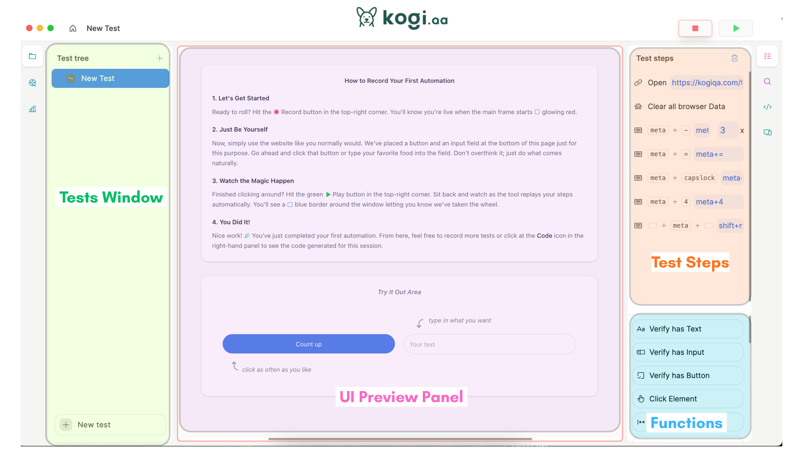

# KogiQA Angular Demo – Record → Export → Run UI Tests

## What is KogiQA?

**KogiQA** is a modern UI automation framework that enables **end-to-end testing without CSS selectors or XPath**. It uses advanced AI and visual recognition to identify UI elements based on their appearance and context, making test automation more maintainable, resilient to UI changes, and significantly easier to write.

### Why KogiQA?

Traditional UI testing relies on brittle selectors:
- **CSS Selectors**: `.button-primary > span`
- **XPath**: `//div[@id='login']/button[2]`

These break whenever the UI structure changes. **KogiQA changes this** by understanding UI elements the way humans do:
- Natural language descriptions
- Visual positioning
- Element context

### Key Features

- ✨ **Selector-Free Automation** – Test your UI without relying on CSS or XPath selectors
- 🎯 **Visual Recognition** – Identify elements by appearance, text, and context
- 🔄 **Resilient Tests** – Reduce test fragility caused by UI structural changes
- 🚀 **Easy to Use** – Simple, intuitive API for writing and maintaining tests
- 🌐 **Language Independent** – Write tests in multiple languages
- 📝 **Record & Export** – Record tests via browser, export as executable code
- ✅ **Comprehensive Coverage** – Support for end-to-end, integration, and component testing

---

## 📋 Overview

This repository demonstrates how to use **KogiQA** to automate UI testing for an **Angular application**.

The goal of this demo is to show the full workflow:

1. Record a test using **KogiQA Recorder**
2. Export the test as **Node.js code**
3. Modify the exported code
4. Execute the test using the **Kogi SDK**

This repo was created as part of a tutorial showing how developers can automate UI testing **without writing complex selectors like XPath or CSS locators**.

---

## 📸 KogiQA Dashboard Overview

Below is the dashboard overview used during the demonstration.



---

## 🧰 Tech Stack

* Angular
* Node.js
* KogiQA SDK
* Chrome + KogiQA Recorder
* Cross-platform support (Linux, macOS, Windows)

---

## 📂 Repository Structure

```
.
├── kogi-demo/                    # Angular demo application
│   ├── src/
│   │   ├── app/
│   │   │   ├── app.component.ts
│   │   │   ├── app.component.html
│   │   │   └── app.component.css
│   │   ├── styles.css
│   │   └── main.ts
│   ├── package.json
│   ├── angular.json
│   └── tsconfig.json
├── kogi-test.js                  # Exported automation test
├── assets/
│   ├── kogi-guide.png            # Dashboard overview screenshot
│   └── kogiqa.svg
└── README.md
```

---

## 🚀 Prerequisites

Make sure the following are installed:

* **Node.js** (v18+ recommended)
* **npm** (comes with Node.js)
* **Angular CLI**
* **Google Chrome** (for KogiQA Recorder)

Check versions:

```bash
node -v
npm -v
ng version
```

Install Angular CLI if needed:

```bash
npm install -g @angular/cli
```

---

## 📥 Installing KogiQA Recorder

KogiQA Recorder is available as a standalone application for all major platforms.

### Download & Install

Visit **[https://kogiqa.com/download/](https://kogiqa.com/download/)** to download the KogiQA application for your platform:

- 🐧 **Linux** – Download `.AppImage` or `.deb`
- 🍎 **macOS** – Download `.dmg` (Intel or Apple Silicon)
- 🪟 **Windows** – Download `.exe` or `.msi`

### Installation Steps

1. Visit [https://kogiqa.com/download/](https://kogiqa.com/download/)
2. Select your operating system (Linux, macOS, or Windows)
3. Download and install the application
4. Launch KogiQA and create/login to your account
5. Get your **API key** from the dashboard

---

## ▶️ Running the Angular Demo App

Navigate to the Angular project:

```bash
cd kogi-demo
```

Install dependencies:

```bash
npm install
```

Start the Angular development server:

```bash
npm start
```

Or use Angular CLI directly:

```bash
ng serve
```

Open the application in your browser:

```
http://localhost:4200
```

This simple login UI is used to demonstrate KogiQA testing. It includes:
- ✨ **Dark/Light Theme Toggle** – Test theme switching
- 📧 **Email Input** – Demonstrate text entry
- 🔐 **Password Input** – Demonstrate sensitive input handling
- ✅ **Remember Me Checkbox** – Test checkbox interactions
- 🔗 **Form Links** – Test navigation and links

---

## 🧪 Recording a Test with KogiQA

### Step 1: Launch KogiQA Recorder

1. Open the KogiQA application (downloaded from [https://kogiqa.com/download/](https://kogiqa.com/download/))
2. Login with your account credentials
3. Create a new test session

### Step 2: Start Recording

1. Point KogiQA to your test URL: `http://localhost:4200`
2. Click **Record** to start capturing actions
3. The Recorder will monitor your interactions

### Step 3: Perform Test Actions

Interact with the application:

* 📧 Enter email: `ajazbeig@gmail.com`
* 🔐 Enter password: `Password@123`
* ☑️ Check "Remember me"
* 🔘 Click "Login"
* 🌓 Toggle dark/light theme

### Step 4: Stop & Export

1. Click **Stop** to finish recording
2. Review the captured steps
3. Click **Export** and select **Node.js SDK**
4. The test code will be generated and ready to use

---

## 📦 Installing Kogi SDK

Install the Kogi SDK in your project:

```bash
npm install kogi
```

---

## 🧪 Running the Automated Test

### Create a Test File

Create `kogi-test.js`:

```javascript
import { Browser } from "kogi"

async function runTest() {
  const apiKey = <API_KEY_HERE>
  
  const page = await Browser.start(apiKey, "local", "localhost:4200 Test")
  
  await page.navigate("http://localhost:4200")
  
  await page.clearSession()
  
  await page.navigate("http://localhost:4200/")
  
  await page.click("Enter your email", {x: 600, y: 290})
  
  await page.type("Email Address", "ajazbeig@gmail.com", {x: 508, y: 269})
  
  await page.pressKey("tab", {repeat: 1})
  
  await page.type("Password", "Password@123", {x: 508, y: 363})
  
  await page.click("After: Remember me", {x: 514, y: 439})
  
  await page.click("Login", {x: 765, y: 489})
  
  await page.close()
}

runTest()
```

### Create a Config File

Create `config.js` to store your API key:

```javascript
export default {
  apiKey: "YOUR_API_KEY_FROM_KOGIQA_DASHBOARD"
}
```

### Run the Test

```bash
node kogi-test.js
```

The test will:
1. Launch a browser controlled by KogiQA
2. Navigate to your Angular app
3. Perform all recorded actions
4. Close the browser session

---

## 🧠 Key Concepts Demonstrated

### 1️⃣ No Selectors Required

**Traditional Approach (Fragile):**
```javascript
// These break if UI structure changes
const loginBtn = document.querySelector('#login-btn')
await click(loginBtn)
```

**KogiQA Approach (Resilient):**
```javascript
// Describes intent, not structure
await page.click("Login", {x: 765, y: 489})
```

### 2️⃣ Export Tests as Code

Tests recorded via the browser can be exported as **Node.js scripts**.

Developers can:
* Modify test steps
* Add assertions
* Extend test logic
* Integrate with CI/CD pipelines

### 3️⃣ Language Independence

KogiQA understands **intent** instead of strict selectors.

Example variations:
```
Click Login
Click Inicia sesión (Spanish)
Login par click karo (Hindi)
```

The meaning is understood regardless of language or phrasing.

### 4️⃣ Coordinate Explanation

You may notice coordinates like `{x: 508, y: 269}` in test code.

**These are NOT used to blindly click fixed screen positions.**

They help the system **disambiguate elements** when multiple UI elements have similar labels.

**Example scenario:**
```
[Button] Submit
[Button] Submit
[Button] Submit
```

Coordinates help identify **which element is intended**.

Developers can also provide alternative hints:
```
await page.click("top-left submit button")
await page.click("bottom-center submit button")
```

---

## 🎥 What This Demo Covers

This project demonstrates:

1. ✅ Recording a UI test with KogiQA Recorder
2. ✅ Exporting automation code as Node.js
3. ✅ Running tests using the Kogi SDK
4. ✅ Editing and extending generated tests
5. ✅ Understanding how KogiQA identifies UI elements
6. ✅ Cross-platform compatibility (Linux, macOS, Windows)

---

## 🔗 Learn More

- 📖 [KogiQA Documentation](https://kogiqa.com/docs)
- 🎬 [Video Tutorials](https://kogiqa.com/tutorials)
- 💬 [Community & Support](https://kogiqa.com/support)
- 📥 [Download KogiQA](https://kogiqa.com/download/)

---

## 👨‍💻 Author

**Ajaz Beig**

This repository accompanies a tutorial showing how developers can automate UI testing workflows using KogiQA without writing complex selectors.

---

## ⭐ If this project helps you

Consider starring the repository and sharing it with the testing community!

---

## 📝 License

This project is provided as-is for educational purposes. See LICENSE file for details.

---

## 🚀 Getting Started Next Steps

1. ✅ Install KogiQA from [https://kogiqa.com/download/](https://kogiqa.com/download/)
2. ✅ Start the Angular demo: `npm start`
3. ✅ Record your first test
4. ✅ Export and run it with the Kogi SDK
5. ✅ Modify and extend the test for your needs
